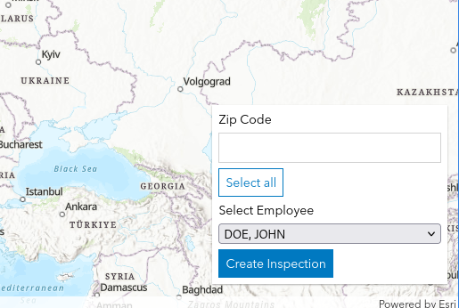

# cw-mock-environment

A local development environment for rapidly building and testing custom ArcGIS widgets for Cityworks. Emulates the Cityworks mapHelper object and API responses, eliminating the need for repetitive .cwmt packaging and manual uploads.

#### The Requirements

The client needs a custom ArcGIS map widget that will allow them to select a grouping of features from a FeatureLayer (see ArcGIS doc on it) on an ArcGIS webmap by Zip code. After selecting the group of features, they would like to select an employee to assign the features to, and create a new report in Trimble's Cityworks. This is the widget that was developed:

#### The Problem

There is no development environment that exists for developing custom widgets. There is a Production environment, and a Test environment. The only way to deploy custom widgets to the test environment is to create a zip file with the following files:

- profiles/default.pcp.json - Cityworks metadata
- layout.pcd.json 
- map-tool-config.json 
- template.css - Styling
- template.js - The transpiled widget code

The zip file must be renamed to .cwmt, and it must be added to Cityworks by dragging-and-dropping the file onto the web interface.

This entire process must be done every time that a change to the widget code is made.

The Cityworks environment this client uses has not been updated in a long time. As of this writing, the latest version of Cityworks I know of is 18.164.8. The version of Cityworks the client uses is 17.144.15. The version of the ArcGIS Javascript Maps SDK used by the client's Cityworks environment is version 4.24, while the latest as of this writing is version 4.32. 

There are some significant differences between these SDK versions. Notably, the later versions of the SDK use ESM modules. Version 4.24 uses the older AMD modules.

Seeing that it is likely that the client will make requests for additional custom ArcGIS map widgets in the future, it became clear that a solution would need to be developed to make the development of them easier. If I can run the custom widget code locally on my own machine, I can rapidly make changes to it and catch errors as a find them, without needing to resort to the cumbersome method of creating a zip file, and dragging and dropping the files into my browser every time I need to make a change to the code. 

#### The Solution

The solution to this problem was to create another web application entirely that runs on my local machine that mimics the functionality of Cityworks. Custom ArcGIS widgets can be developed in this local environment and deployed to the client's Cityworks Test environment without needing to make any changes to the widget code. 

A zip file was provided with a very basic template widget as a starting point.  The template widget provided was a Typescript class called CWTemplate that encapsulates the ArcGIS Javascript SDK Widget class, with the added dependency of an object called mapHelper, which represents the Cityworks environment surrounding the ArcGIS map. 

The main challenge creating this application was creating the functionality necessary to emulate this mapHelper object. I decided to create a Typescript class, CWMapHelper, and another Typescript class CWMockDataGenerator. CWMapHelper represents the Cityworks environment, and CWMockDataGenerator is a class to create (very) simple mock data that is similar to the data that would be returned from the Cityworks REST API. 

#### The Results

This application, though it took some time initially to stand up, has made the development experience of these widgets significantly better and has saved me a huge amount of time that would otherwise be spent laboriously zipping files and dragging and dropping. When future requests from this client for custom ArcGIS map widgets come in, I can now rapidly develop and deploy them.
